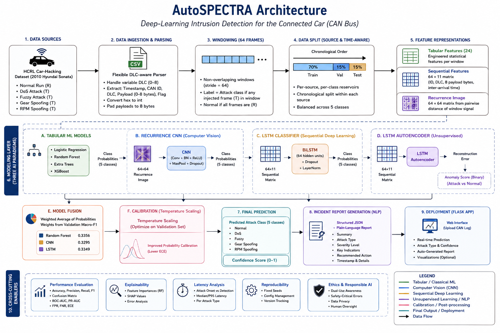

# AutoSPECTRA

## Deep-Learning Intrusion Detection and Incident Reporting for Connected-Car CAN Bus Traffic

<p align="center">
  <strong>Five-class CAN-bus intrusion detection using machine learning, computer vision, sequence modelling, anomaly detection, calibrated fusion and controlled incident reporting.</strong>
</p>

---


<p align="center">
  
</p>
<p align="center"><em>Figure 1. AutoSPECTRA end-to-end architecture: CAN ingestion, leakage-aware windowing, multi-representation AI models, fusion/calibration, incident reporting and Flask deployment.</em></p>

## 1. Project Overview

**AutoSPECTRA** is an academic defensive cybersecurity prototype for analysing Controller Area Network (CAN) traffic from connected vehicles. It processes chronological CAN-message windows and classifies each window into one of five classes:

- **Normal**
- **DoS**
- **Fuzzy**
- **Gear spoofing**
- **RPM spoofing**

The project integrates multiple AI and data-science approaches:

- engineered-feature machine learning;
- recurrence-image computer vision;
- Bidirectional LSTM sequence modelling;
- normal-only LSTM autoencoder anomaly detection;
- validation-weighted probability fusion;
- temperature-based confidence calibration;
- controlled rule-based natural-language incident reporting;
- a Flask application for live demonstration.

AutoSPECTRA is a **decision-support and research prototype**. It is not a certified automotive intrusion-detection system and must not automatically control braking, steering, engine, transmission, or other safety-critical vehicle functions.

---

## 2. Module and Assessment Context

| Field | Details |
|---|---|
| Module | Advanced Artificial Intelligence Projects in Data Science |
| Module Code | 55-710603 |
| Module Leader | Royce Copley |
| Level | 7 |
| Assessment | AI Project and Pitch |
| Group | Group 7 |
| Project | AutoSPECTRA |
| Main Dataset | HCRL Car-Hacking Dataset |
| Main Tools | Python, Kaggle, scikit-learn, XGBoost, PyTorch, Flask |

The project supports the module learning outcomes by demonstrating modern AI techniques, a complete implemented AI solution, critical technical/social evaluation, and responsible-AI analysis.

---

## 3. Team Roles and Contributions

| No. | Team Member | Main Role | Main Contribution |
|---:|---|---|---|
| 1 | **Amit Das** | Data Pipeline, Integration & Evaluation Lead | HCRL data discovery, DLC-aware parsing, 64-frame windows, protected chronological split, 24 tabular features, classical baselines, leakage checks and reproducibility validation. |
| 2 | **Aahmad Sayeed** | Computer Vision & CNN Lead | CAN-to-image recurrence representation, Recurrence CNN implementation/evaluation, CNN confusion/ROC/PR/confidence evidence and visual-model integration. |
| 3 | **Maheswari Kamireddy** | Sequence Learning, Autoencoder, Fusion & Ablation Lead | Bidirectional LSTM, normal-only autoencoder, validation-only anomaly thresholding, RF+CNN+LSTM fusion, temperature calibration and feature-group ablation. |
| 4 | **Miftha Thahniyath** | NLP Incident Reporting, Flask & Live Demo Lead | Structured incident-report schema, controlled plain-language reporting, Flask application, prediction/error manifests, README/run instructions and live-demo workflow. |
| 5 | **Nagireddy Nakka** | Ethics, Responsible AI & Critical Evaluation Lead | False-positive/false-negative analysis, dataset bias, CAN-ID shortcut learning, privacy, dual use, generalisation limitations, human oversight and future-work review. |

All members documented work through GitHub commits, issues, pull requests, reviews, technical notes, notebooks, and evidence artifacts.

---

## 4. System Architecture


> **Architecture image path:** keep the diagram in `docs/images/autospectra_architecture.png` so GitHub renders both figures correctly.

<p align="center">
  
</p>
<p align="center"><em>Figure 2. Detailed AutoSPECTRA system architecture used in the final implementation.</em></p>

```text
HCRL CAN captures
      |
      v
Dataset discovery and validation
      |
      v
Memory-efficient DLC-aware parser
      |
      v
Chronological 64-frame windows
      |
      v
Source-aware + class-aware chronological split
      |
      +-------------------------+-------------------------+
      |                         |                         |
      v                         v                         v
24 tabular features       64 x 11 sequence        64 x 64 recurrence image
      |                         |                         |
      v                         v                         v
LR / RF / ET / XGB         BiLSTM / AE             Recurrence CNN
      \                         |                         /
       \________________________|________________________/
                                |
                                v
                  RF + CNN + LSTM soft-voting fusion
                                |
                                v
                     Temperature calibration
                                |
                                v
                      Five-class CAN prediction
                                |
                                v
               Structured JSON + incident report
                                |
                                v
                        Flask live application
```

---

## 5. Dataset

### Primary Dataset

The project uses the **HCRL Car-Hacking Dataset**, containing real in-vehicle CAN traffic and injected attack traffic.

Official HCRL dataset page:

<https://ocslab.hksecurity.net/Datasets/CAN-intrusion-dataset>

Kaggle mirror used for the project:

<https://www.kaggle.com/datasets/pranavjha24/car-hacking-dataset>

### Source Files Used by the Final Experiment

```text
DoS_dataset.csv
Fuzzy_dataset.csv
gear_dataset.csv
RPM_dataset.csv
```

The final five-class experiment derives **Normal** windows from legitimate `R` frames contained inside the attack-source captures.

> **Important:** Raw HCRL data is not stored in this GitHub repository. Download or attach the dataset separately before running the training notebook.

### Dataset Citation

Song, H. M., Woo, J., & Kim, H. K. (2020). *In-vehicle network intrusion detection using deep convolutional neural network*. Vehicular Communications, 21, 100198.

Seo, E., Song, H. M., & Kim, H. K. (2018). *GIDS: GAN based intrusion detection system for in-vehicle network*. 16th Annual Conference on Privacy, Security and Trust (PST).

---

## 6. Pre-trained Models — OneDrive

The trained model binaries are too large / unsuitable to maintain directly in the submitted GitHub repository.

### Model Download

Open the repository file below:

**[`models`](./models)**

That file contains the **OneDrive access link** for the trained AutoSPECTRA model artifacts.

After downloading the files from OneDrive, place them in the Flask application's model directory as documented by the deployment manifest, for example:

```text
AutoSPECTRA_Flask_App/
└── models/
    ├── random_forest.joblib
    ├── extra_trees.joblib
    ├── logistic_regression.joblib
    ├── xgboost_model.json            # when exported
    ├── recurrence_cnn.pt             # when included
    ├── lstm_classifier.pt
    ├── lstm_autoencoder.pt           # optional anomaly model
    ├── fusion_weights.json           # when included
    └── fusion_calibration.json       # when included
```

The exact available files should be checked against:

```text
deployment_manifest.json
class_mapping.json
```

### Important Model Compatibility Note

The exported scikit-learn tree models were created with a newer scikit-learn environment. For reliable local loading, use the environment defined in `requirements.txt` rather than an old system Python environment.

**Recommended local environment:** Python **3.10 or 3.11**.

Do not use the legacy Python 3.7 / scikit-learn 0.22 environment shown during early local testing. It can produce errors such as:

```text
No module named 'numpy._core'
```

or warnings about loading estimators created with a different scikit-learn version.

---

## 7. Repository / Flask Application Structure

The final application folder is organised approximately as follows:

```text
AutoSPECTRA_Flask_App/
├── autospectra/                    # reusable preprocessing / inference code
├── sample_data/                    # small demonstration input files
├── static/                         # CSS, JavaScript and generated assets
├── templates/                      # Flask HTML templates
├── README.md
├── app.py                          # local Flask entry point
├── class_mapping.json
├── deployment_manifest.json
├── estimated_detection_latency.csv
├── experiment_summary.json
├── export_models_from_kaggle.py
├── kaggle_launch.py
├── models                          # text/link file containing OneDrive model access
├── multiclass_model_comparison.csv
├── per_class_metrics.csv
├── requirements.txt
├── run_local.bat                   # Windows launcher, when present
└── run_local.sh                    # Linux/macOS launcher, when present
```

The complete project repository also contains weekly notebooks, documentation, evaluation artifacts, GitHub evidence, and final report/presentation materials.

---

## 8. Environment Setup

### Recommended Python Version

Use **Python 3.10 or Python 3.11** for the final local demo.

Check your version:

```bash
python --version
```

### Windows

```bat
python -m venv .venv
.venv\Scripts\activate
python -m pip install --upgrade pip
pip install -r requirements.txt
```

### Linux / macOS

```bash
python3 -m venv .venv
source .venv/bin/activate
python -m pip install --upgrade pip
pip install -r requirements.txt
```

### Verify Installation

```bash
python -c "import flask, numpy, pandas, sklearn; print('Environment OK')"
```

If PyTorch models are used by the selected deployment configuration:

```bash
python -c "import torch; print(torch.__version__)"
```

---

## 9. Running the Flask Live Demo

### Step 1 — Download the Models

Open:

```text
models
```

in the GitHub folder, follow the OneDrive link, download the required model files, and place them in the application model directory.

### Step 2 — Install Dependencies

```bash
pip install -r requirements.txt
```

### Step 3 — Start the Application

From the `AutoSPECTRA_Flask_App` directory:

```bash
python app.py
```

or, when provided:

**Windows**

```bat
run_local.bat
```

**Linux / macOS**

```bash
chmod +x run_local.sh
./run_local.sh
```

### Step 4 — Open the Interface

Open:

```text
http://127.0.0.1:5000
```

### Step 5 — Analyse CAN Traffic

1. Select a trained model available in the application.
2. Upload an HCRL-style CAN traffic file or provided sample data.
3. AutoSPECTRA validates and parses the CAN frames.
4. Chronological 64-frame windows are constructed.
5. The selected model performs inference.
6. The interface displays class predictions and confidence.
7. The application generates charts and incident evidence.
8. Structured CSV/JSON outputs can be downloaded.
9. Plain-language incident reports are shown for notable attack windows.

### Demonstration Flow

```text
Upload CAN file
      |
      v
Parse + validate
      |
      v
64-frame chronological windows
      |
      v
AI inference
      |
      v
Prediction + confidence
      |
      +--> predicted-class chart
      +--> confidence timeline
      +--> CAN message-rate chart
      +--> probability heatmap
      |
      v
Structured JSON + plain-language incident report
      |
      v
Human analyst review
```

The live assessment demonstration should use the running application rather than screenshots or prerecorded video.

---

## 10. Running the End-to-End Training / Evaluation Notebook

The authoritative end-to-end notebook should be run in Kaggle with the HCRL dataset attached.

Recommended workflow:

1. Open Kaggle.
2. Create a notebook.
3. Attach the Car-Hacking Dataset.
4. Upload the final AutoSPECTRA notebook.
5. Enable GPU acceleration for deep-learning stages if available.
6. Run all cells from top to bottom.

The complete experiment performs:

- data discovery and parsing;
- source/class-aware chronological window generation;
- 24-feature tabular representation;
- 64 x 11 sequence representation;
- 64 x 64 recurrence-image representation;
- Logistic Regression;
- Random Forest;
- Extra Trees;
- XGBoost;
- Recurrence CNN;
- Bidirectional LSTM;
- LSTM autoencoder;
- validation-weighted fusion;
- temperature calibration;
- feature ablation;
- latency analysis;
- incident reporting;
- Flask deployment export.

Typical final outputs include:

```text
/kaggle/working/AutoSPECTRA_Artifacts.zip
/kaggle/working/AutoSPECTRA_Flask_Deployment.zip
/kaggle/working/AutoSPECTRA_Week08_Images.zip
/kaggle/working/AutoSPECTRA_Week08_Evidence.zip
```

---

## 11. Data Pipeline and Leakage Controls

### DLC-aware Parsing

The raw CAN files contain variable-length payloads, so the `R` / `T` flag is not assumed to exist at a fixed column index.

The parser:

1. reads timestamp, CAN ID and DLC;
2. uses DLC to identify valid payload positions;
3. locates the final normal/attack flag;
4. converts hexadecimal CAN IDs and payload bytes;
5. pads payloads to eight positions;
6. processes large files in chunks;
7. preserves chronological order;
8. records invalid/dropped rows.

### Windowing

| Setting | Final Value |
|---|---:|
| Window size | 64 CAN frames |
| Stride | 64 CAN frames |
| Overlap | None |
| Classes | 5 |
| Minimum attack frames for attack label | 1 |

### Protected Split

The final split strategy is:

> **Source-aware, class-aware, chronologically partitioned reservoir sampling.**

```text
70% Training
15% Validation
15% Test
```

The workflow explicitly checks class coverage and avoids random frame-level splitting that could leak temporally adjacent traffic between partitions.

---

## 12. Feature Representations

### 24 Tabular Features

Features cover:

- duration and message rate;
- inter-arrival-time statistics;
- CAN-ID diversity, entropy and dominance;
- ID transitions;
- DLC statistics;
- payload mean, standard deviation and entropy;
- non-zero-byte ratio;
- payload changes;
- payload-sum statistics.

### 64 x 11 Sequence

Each sequence contains:

- normalised CAN ID;
- normalised DLC;
- eight normalised payload bytes;
- log-scaled inter-arrival time.

### 64 x 64 Recurrence-Style Image

The CNN uses a recurrence-style pairwise-distance representation derived from each 64-frame sequence.

---

## 13. Models

### Classical Machine Learning

- Logistic Regression
- Random Forest
- Extra Trees
- XGBoost

### Deep Learning

- Recurrence-image CNN
- Bidirectional LSTM classifier
- Normal-only LSTM autoencoder

### Fusion and Calibration

Random Forest, CNN, and LSTM probabilities are combined by validation-derived weighted soft voting. Temperature scaling is selected using validation log loss to improve probability calibration.

The test set is not used to select fusion weights, temperature, or autoencoder threshold.

---

## 14. Evaluation Metrics

AutoSPECTRA reports:

- accuracy;
- balanced accuracy;
- macro precision / recall / F1;
- weighted F1;
- per-class precision / recall / F1;
- confusion matrices;
- ROC-AUC;
- PR-AUC;
- attack false-positive rate;
- attack false-negative rate;
- expected calibration error;
- log loss;
- model size;
- inference time;
- throughput;
- estimated detection latency;
- feature-group ablation;
- anomaly-detection performance.

**Macro-F1** is treated as the main multiclass model-selection metric because every class contributes equally.

---

## 15. Final Stored Results

The final balanced fast-mode experiment used:

| Split | Total Windows | Windows per Class |
|---|---:|---:|
| Training | 17,500 | 3,500 |
| Validation | 4,000 | 800 |
| Test | 4,000 | 800 |

### Multiclass Models

| Model | Accuracy | Macro-F1 |
|---|---:|---:|
| Random Forest | 0.99775 | **0.997754** |
| XGBoost | 0.99775 | **0.997754** |
| Extra Trees | 0.99725 | 0.997256 |
| Logistic Regression | 0.99650 | 0.996511 |
| Calibrated RF + CNN + LSTM Fusion | 0.99525 | 0.995270 |
| Bidirectional LSTM | 0.99475 | 0.994771 |
| Recurrence CNN | 0.98050 | 0.980563 |

Random Forest and XGBoost achieved the joint-highest stored test macro-F1. Random Forest is retained as the principal deployment fallback because it combines strong accuracy, low inference cost, interpretability, and straightforward local deployment.

### Autoencoder

| Metric | Result |
|---|---:|
| Accuracy | 0.6895 |
| Precision | 0.9558 |
| Recall | 0.6416 |
| F1 | 0.7678 |
| ROC-AUC | 0.7135 |
| PR-AUC | 0.9322 |

The autoencoder is treated as a **secondary anomaly signal**, not the primary detector.

### Calibration

Temperature scaling reduced the fusion expected calibration error approximately from:

```text
0.024620 -> 0.001828
```

This improved confidence quality but did not make fusion the strongest classifier.

---

## 16. Feature-Ablation Findings

| Feature Group | Macro-F1 |
|---|---:|
| CAN ID + timing | 0.997754 |
| All 24 features | 0.997505 |
| CAN ID only | 0.997505 |
| Payload only | 0.993527 |
| Timing only | 0.707266 |

The near-perfect CAN-ID-only result is both a performance finding and a **generalisation warning**: models may learn vehicle/capture-specific CAN identifier patterns rather than universally transferable attack behaviour.

---

## 17. Detection-Latency Evidence

Approximate median upper-bound attack-onset-to-window-end latency:

| Attack | Median Upper-Bound Latency |
|---|---:|
| RPM spoofing | ~25.75 ms |
| Gear spoofing | ~28.92 ms |
| Fuzzy | ~53–54 ms |
| DoS | ~55–56 ms |

These values represent window-completion latency and are **not** complete real-vehicle response times.

---

## 18. Incident Reporting

The final reporting layer uses **controlled template-based natural-language generation**, not unrestricted external generative AI.

An incident report can contain:

- selected model;
- predicted class;
- confidence;
- severity;
- window timestamps;
- dominant CAN ID;
- message rate;
- unique CAN-ID count;
- CAN-ID entropy;
- recommended defensive action;
- explicit human-oversight statement.

Example:

```json
{
  "system": "AutoSPECTRA",
  "predicted_class": "DoS",
  "confidence": 0.988,
  "severity": "Critical",
  "window_size_frames": 64,
  "dominant_can_id": "0x000",
  "recommended_action": "Alert the security operator, preserve the CAN trace, and investigate the suspected flooding source.",
  "human_oversight": "Decision-support alert only. Human review is required before any operational response."
}
```

---

## 19. Responsible AI, Ethics and Safety

AutoSPECTRA follows these principles:

- defensive cybersecurity use only;
- no automatic safety-critical vehicle control;
- mandatory human oversight;
- confidence is evidence, not certainty;
- false positives and false negatives are evaluated separately;
- benchmark and generalisation limits are disclosed;
- raw research data is not committed;
- access tokens and secrets must not be committed;
- dual-use risk is documented;
- output is intended to support, not replace, qualified security analysts.

### Key Risks

| Risk | Potential Consequence | Control |
|---|---|---|
| False negative | Attack is missed | FNR reporting, multiple models, analyst review |
| False positive | Alert fatigue / unnecessary intervention | FPR reporting, confidence display, no automatic control |
| Dataset bias | Poor performance on different vehicles | Explicit limitation and future cross-vehicle validation |
| CAN-ID shortcut learning | Benchmark-specific success | Feature ablation and cross-dataset future work |
| Misinterpreted confidence | Over-trust in model output | Calibration analysis and human oversight |
| Dual use | Offensive misuse | Defensive-only scope and no attack-execution tooling |

---

## 20. Known Limitations

- The principal benchmark represents one vehicle environment.
- Balanced experimental windows do not represent natural attack prevalence.
- CAN IDs can create vehicle-specific shortcut signals.
- The independent normal capture is not the main Normal source in the stored five-class experiment.
- No complete cross-vehicle/cross-dataset validation is included in the stored final run.
- Fusion does not outperform the strongest standalone tree models on macro-F1.
- The normal-only autoencoder misses too many attacks for primary deployment.
- Detection latency is estimated at window level.
- The local Flask application is an academic prototype.
- The system has not been safety-certified or validated in a moving real vehicle.

---

## 21. Reproducibility Controls

The project uses:

- fixed random seeds;
- explicit class order;
- versioned split strategy;
- configuration-based data processing;
- class-coverage assertions;
- non-overlapping windows;
- validation-only checkpoint selection;
- validation-only fusion weights;
- validation-only calibration temperature;
- validation-only anomaly threshold selection;
- held-out test isolation;
- saved metrics and figures;
- environment requirements;
- GitHub commits, issues, pull requests and peer review.

Authoritative class order:

```text
Normal, DoS, Fuzzy, Gear, RPM
```

---

## 22. GitHub Project-Management Workflow

For weekly contribution evidence, each member should:

1. work on a role-specific branch;
2. create/receive an assigned GitHub issue;
3. move the issue through the project board;
4. commit meaningful incremental work;
5. use descriptive commit messages;
6. record non-code work as Markdown/documents;
7. open a pull request;
8. request peer review;
9. merge only after review;
10. retain evidence in GitHub history.

Example descriptive commit messages:

```text
Data: implement DLC-aware HCRL parsing
Notebook: add Week 5 recurrence CNN experiment
Eval: add fusion calibration and ablation evidence
Ethics: document cross-vehicle generalisation risk
App: add final AutoSPECTRA Flask demonstration source
```

---

## 23. Troubleshooting

### Error: Flask version cannot be installed

If you see an error similar to:

```text
Could not find a version that satisfies the requirement Flask<4,>=3.1
```

check your Python version:

```bash
python --version
```

Use Python 3.10 or 3.11 in a fresh virtual environment.

### Error: `No module named 'numpy._core'`

This usually indicates an incompatible legacy NumPy/scikit-learn environment loading a newer serialized model.

Recommended fix:

```bat
py -3.11 -m venv .venv
.venv\Scripts\activate
python -m pip install --upgrade pip
pip install -r requirements.txt
```

Then restart the Flask application.

### Warning: model created with scikit-learn 1.6.1 but current version is older

Do not rely on the old environment. Install the versions defined by the project requirements before running the final demo.

### Some models are unavailable but the app launches

Check:

1. the OneDrive model download is complete;
2. the files are in the expected model directory;
3. names match `deployment_manifest.json`;
4. the Python/scikit-learn/PyTorch environment is compatible.

The application may still expose other successfully loaded models, but the final demonstration should be tested in advance with the intended model.

---

## 24. Submission Checklist

### Source Code

- [ ] `README.md` included.
- [ ] `requirements.txt` included.
- [ ] `app.py` included.
- [ ] reusable source modules included.
- [ ] HTML/static assets included.
- [ ] sample demonstration data included where permitted.
- [ ] final notebook included.
- [ ] evaluation CSV/JSON evidence included.
- [ ] OneDrive model-access link included through `models`.
- [ ] dataset link included.
- [ ] no raw large dataset committed.
- [ ] no API keys, passwords, tokens or private credentials committed.

### Live Demo

- [ ] environment created with supported Python version;
- [ ] requirements installed successfully;
- [ ] model files downloaded from OneDrive;
- [ ] application starts locally;
- [ ] sample file uploads successfully;
- [ ] predictions and confidence display;
- [ ] charts render;
- [ ] CSV/JSON downloads work;
- [ ] incident report renders;
- [ ] human-oversight limitation is explained.

---

## 25. Future Work

Recommended extensions include:

- validation on multiple vehicle platforms;
- independent normal-driving captures;
- ROAD or another independent CAN intrusion benchmark;
- stealthier and lower-rate attack scenarios;
- streaming evaluation and concept-drift detection;
- stronger explainability for security analysts;
- secure edge deployment on automotive-grade hardware;
- hardware-in-the-loop latency measurement;
- adversarial robustness testing;
- formal automotive cybersecurity and safety validation.

---

## 26. Academic and Defensive-Use Disclaimer

AutoSPECTRA was created for academic research, learning, and defensive cybersecurity evaluation.

It is **not**:

- a commercial automotive cybersecurity product;
- a certified intrusion-detection system;
- a replacement for professional automotive-security review;
- authorised to inject malicious CAN traffic into real vehicles;
- authorised to control a vehicle;
- suitable for unsupervised safety-critical decision-making.

---

## 27. Final Project Status

```text
Technical Milestone 1: Repository, architecture and governance              Completed
Technical Milestone 2: HCRL parsing, audit and EDA                         Completed
Technical Milestone 3: Windowing, protected split and representations      Completed
Technical Milestone 4: Classical ML baselines                              Completed
Technical Milestone 5: Recurrence CNN                                      Completed
Technical Milestone 6: BiLSTM and autoencoder                              Completed
Technical Milestone 7: Fusion, calibration, ablation and latency           Completed
Technical Milestone 8: Incident reporting, Flask and final release         Completed
```

These eight technical milestones sit within the wider 12-week module/project lifecycle, including formative feedback, report preparation, demonstration rehearsal, final validation, and assessment delivery.

---

## 28. Quick Start

For the final Flask demonstration:

```text
1. Install Python 3.10/3.11
2. Create and activate a virtual environment
3. pip install -r requirements.txt
4. Open the repository file: models
5. Follow the OneDrive link and download the trained models
6. Place the model files in the expected model directory
7. python app.py
8. Open http://127.0.0.1:5000
9. Upload a sample HCRL-style CAN file
10. Review prediction, confidence, visualisations and incident report
```

**Human oversight is required for all AutoSPECTRA alerts.**
