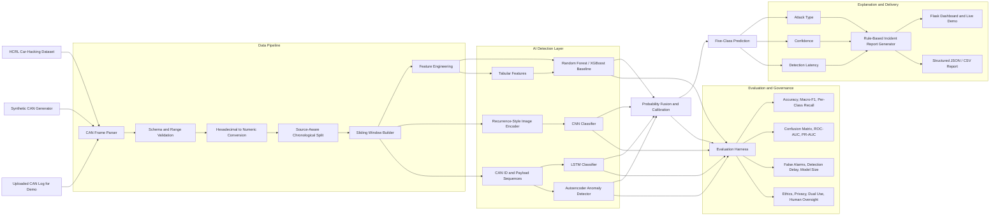

# AutoSPECTRA System Architecture — Week 1 Baseline

This diagram records the architecture agreed during Week 1. It is expected to evolve through reviewed pull requests.

## Architectural decisions recorded in Week 1

1. **The split must be source-aware and chronological.** Randomly mixing nearby CAN frames across training and testing can inflate results.
2. **A conventional baseline is mandatory.** Random Forest or XGBoost provides a transparent and dependable comparison.
3. **CNN and LSTM branches answer different questions.** The CNN learns image-encoded traffic patterns; the LSTM learns temporal dependencies.
4. **The autoencoder is an anomaly detector, not automatically a five-class classifier.**
5. **Fusion must be validated.** The combined model is retained only if it improves macro-F1, attack recall or calibration without unacceptable latency.
6. **The report generator is symbolic and controlled.** It converts structured detection evidence into a human-readable report.
7. **No automated vehicle control.** The prototype generates decision-support alerts only.
